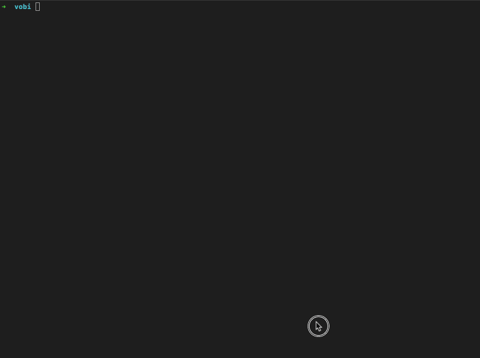

# Vobi Cli
Command line tool

### Install
Install vobi-graphql
```
npm install -g vobi-graphql
```

after installing `vobi-graphql` you can generate graphql queries, mutations and Subscriptions

```
vobi-graphql generator -e https://api-myid.vobi.io/graphql -c './Desktop'
```



### `Options`

|  Options | description |
|---------|-------------|
|  -c, --config [config] | Config path. Defaults to ./.gql-gen.json|
|  -e, --endpoint [endpoint] | Graphql endpoint recursively |
|  -s, --schema [schema] | Graphql schema path |
|  -d, --dir [dir] | Destination directory. Defaults to "gql" dir in working directory |
| -g, --gen-dir [genDir] | Generated directory name inside destination directory. Defaults to "generated"  |

